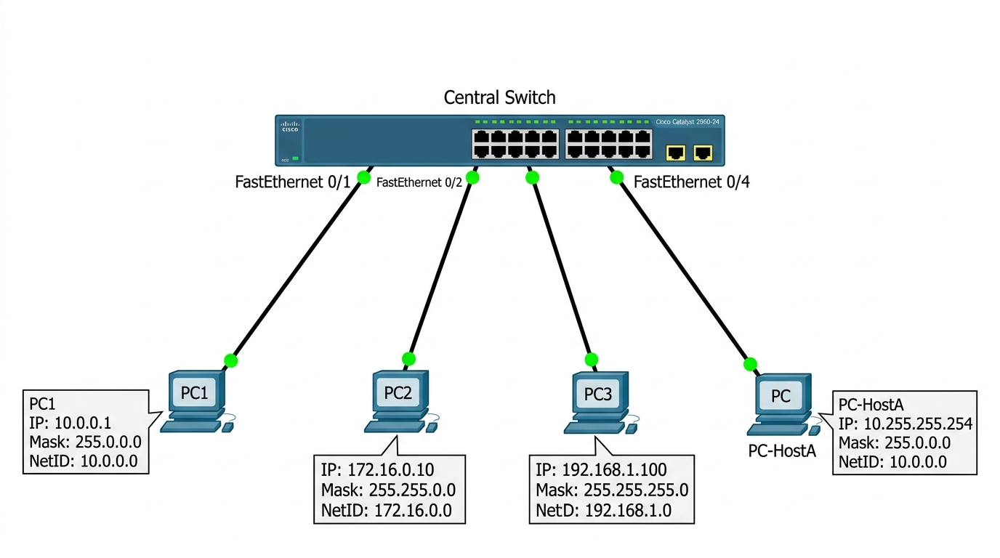
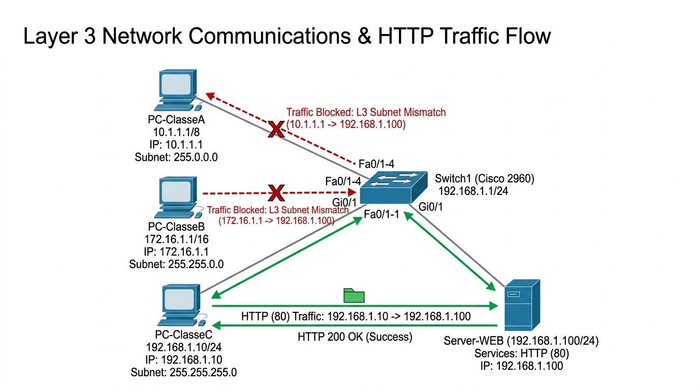

# INSTITUTO FEDERAL DE EDUCAÇÃO, CIÊNCIA E TECNOLOGIA DE SÃO PAULO
## Câmpus São Carlos — Bacharelado em Engenharia de Software / ADS
**Disciplina:** Redes de Computadores 2 (SCLRCO2)  
**Docente:** Prof. Dr. Luiz Henrique Castelo Branco  
**Discente:** Rafael Feltrim  
**Data:** 17 de Agosto de 2026  

---

# ATIVIDADE 03: RELATÓRIO DE LABORATÓRIO PRÁTICO (CLASSES DE REDE)
*Documento de Referência: `pratica_classes_de_rede_ifsp.pdf` (Roteiro de Endereçamento IP sem Roteamento no Cisco Packet Tracer)*

---

## 1. Visão Geral e Topologia Física Base
Todas as 8 atividades deste roteiro prático foram executadas utilizando exclusivamente **Switches de Camada 2** (Cisco Catalyst 2960-24TT) e conexões físicas por cabos de cobre direto (*Copper Straight-Through*). O objetivo é comprovar o comportamento do modelo OSI nas camadas de Enlace (L2) e Rede (L3), o funcionamento da operação lógica AND, a resolução ARP e o tráfego Unicast, Broadcast e de Aplicação (HTTP na porta 80).

---

## 2. Execução das Atividades Práticas de Laboratório

### ATIVIDADE 01: Criação de Rede de Classe A (10.0.0.0/8)
- **Conceito Chave:** Na Classe A (/8), apenas o 1º octeto identifica o NetID (`10.0.0.0`) e os 3 últimos definem o Host. Máscara padrão: `255.0.0.0`.
- **Tabela de Configuração e Resultados:**
  | Dispositivo | Interface | Endereço IP | Máscara | NetID Calculado | Resultado do Teste de Ping (ICMP) |
  | :--- | :--- | :--- | :--- | :--- | :--- |
  | **PC1** | FastEthernet0 | `10.0.0.1` | `255.0.0.0` | `10.0.0.0` | Origem dos testes |
  | **PC2** | FastEthernet0 | `10.0.0.2` | `255.0.0.0` | `10.0.0.0` | Sucesso (0% de perda, tempo &lt;1ms) |
  | **PC3** | FastEthernet0 | `10.0.0.3` | `255.0.0.0` | `10.0.0.0` | Sucesso (0% de perda, tempo &lt;1ms) |
- **Análise Técnica:** O PC1 realiza a operação lógica bit a bit `IP_Destino AND 255.0.0.0` e verifica que ambos pertencem ao mesmo NetID (`10.0.0.0`). A comunicação ocorre diretamente na Camada 2 através do switch, sem necessidade de roteador.

---

### ATIVIDADE 02: Criação de Rede de Classe B (172.16.0.0/16) em Simulation Mode
- **Conceito Chave:** Na Classe B (/16), os 2 primeiros octetos definem a Rede e os 2 últimos o Host. Máscara padrão: `255.255.0.0`.
- **Tabela de Configuração e Resultados:**
  | Dispositivo | Interface | Endereço IP | Máscara | NetID Calculado | Validação no Simulation Mode |
  | :--- | :--- | :--- | :--- | :--- | :--- |
  | **PC1** | FastEthernet0 | `172.16.0.10` | `255.255.0.0` | `172.16.0.0` | Responde ICMP Echo Reply |
  | **PC2** | FastEthernet0 | `172.16.0.20` | `255.255.0.0` | `172.16.0.0` | Origem do Ping / ARP Request |
  | **PC3** | FastEthernet0 | `172.16.0.30` | `255.255.0.0` | `172.16.0.0` | Responde ICMP Echo Reply |
- **Análise no Simulador:** No primeiro envio, o PC2 dispara um quadro ARP em broadcast (`FF:FF:FF:FF:FF:FF`). O switch realiza o flooding em todas as portas. Uma vez preenchida a tabela CAM (MAC Address Table), os pacotes ICMP Unicast trafegam exclusivamente ponto a ponto entre a porta do PC2 e a porta do PC1/PC3.

---

### ATIVIDADE 03: Criação de Rede de Classe C (192.168.1.0/24) e Inspeção ARP
- **Conceito Chave:** Na Classe C (/24), os 3 primeiros octetos definem o NetID (`192.168.1.0`) e o último define o Host. Máscara padrão: `255.255.255.0`.
- **Tabela de Configuração e Cache ARP:**
  | Dispositivo | Endereço IP | Máscara | NetID | Endereço MAC Físico | Status do Cache ARP (`arp -a`) |
  | :--- | :--- | :--- | :--- | :--- | :--- |
  | **PC1** | `192.168.1.100` | `255.255.255.0` | `192.168.1.0` | `0001.96B2.41A1` | Mapeado dinamicamente no PC3 |
  | **PC2** | `192.168.1.101` | `255.255.255.0` | `192.168.1.0` | `0001.96B2.41A2` | Mapeado dinamicamente no PC3 |
  | **PC3** | `192.168.1.102` | `255.255.255.0` | `192.168.1.0` | `0001.96B2.41A3` | Tabela ARP: `192.168.1.100/101 OK` |
- **Validação de Linha de Comando:** A execução do comando `arp -a` no terminal do PC3 confirma a criação de entradas dinâmicas associando cada endereço IP lógico ao endereço de hardware da interface correspondente.

---

### ATIVIDADE 04: Variação de Octetos de Host na Classe A
- **Objetivo:** Demonstrar que variações radicais nos 2º, 3º e 4º octetos não alteram o NetID em redes de Classe A com máscara `/8`.
- **Tabela de Configuração e Operação Lógica AND:**
  | Host | Endereço IP | Máscara | Operação AND (IP &amp; Máscara) | NetID Resultante | Ping a partir do PC-A |
  | :--- | :--- | :--- | :--- | :--- | :--- |
  | **PC-A** | `10.0.0.5` | `255.0.0.0` | `10.0.0.5 AND 255.0.0.0` | `10.0.0.0` | Origem |
  | **PC-B** | `10.0.10.15` | `255.0.0.0` | `10.0.10.15 AND 255.0.0.0` | `10.0.0.0` | 100% Sucesso |
  | **PC-C** | `10.100.200.2` | `255.0.0.0` | `10.100.200.2 AND 255.0.0.0` | `10.0.0.0` | 100% Sucesso |
  | **PC-D** | `10.255.255.254` | `255.0.0.0` | `10.255.255.254 AND 255.0.0.0` | `10.0.0.0` | 100% Sucesso |
- **Questão de Análise:** *Por que o PC-A consegue se comunicar com o PC-D mesmo com os 2º, 3º e 4º octetos completamente diferentes?*  
  **Resposta:** Porque a máscara padrão de Classe A (`255.0.0.0`) filtra estritamente os primeiros 8 bits (1º octeto). Como todos os hosts iniciam com o octeto `10`, todos compartilham o mesmo NetID (`10.0.0.0/8`) e pertencem ao mesmo domínio de broadcast L2, permitindo comunicação direta sem Gateway.

---

### ATIVIDADE 05: Isolamento Lógico entre Duas Redes de Classe B no Mesmo Switch
- **Objetivo:** Configurar duas redes distintas de Classe B (`172.16.0.0/16` e `172.17.0.0/16`) no mesmo switch físico e validar o bloqueio L3 sem roteador.
- **Tabela de Configuração e Resultados:**
  | Setor / Host | Endereço IP | Máscara | Rede Lógica (NetID) | Ping de PC-Vendas1 | Causa do Resultado |
  | :--- | :--- | :--- | :--- | :--- | :--- |
  | **PC-Vendas1** | `172.16.1.10` | `255.255.0.0` | `172.16.0.0` | Origem | Host local |
  | **PC-Vendas2** | `172.16.2.20` | `255.255.0.0` | `172.16.0.0` | **Sucesso (Reply)** | Mesmo NetID (`172.16.0.0`) |
  | **PC-TI1** | `172.17.1.10` | `255.255.0.0` | `172.17.0.0` | **Request Timed Out** | NetID diferente (`172.17.0.0`) |
  | **PC-TI2** | `172.17.2.20` | `255.255.0.0` | `172.17.0.0` | **Request Timed Out** | Sem Default Gateway L3 |
- **Questão de Análise:** *O switch físico retransmite os quadros, mas por que a comunicação falha no nível de rede (L3)?*  
  **Resposta:** Ao processar o destino `172.17.1.10`, o PC-Vendas1 calcula que ele pertence a uma rede lógica externa (`172.17.0.0`). Como não há um Roteador (Default Gateway) configurado, a pilha TCP/IP da máquina de origem descarta o pacote e aborta o envio, gerando *Request Timed Out*.

---

### ATIVIDADE 06: Diagnóstico de Falha por Máscara Incompatível (/24 vs /16)
- **Cenário:** Três PCs conectados ao mesmo switch, sendo o PC2 configurado erroneamente com máscara `/16` em vez de `/24`.
- **Tabela de Diagnóstico:**
  | Dispositivo | Endereço IP | Máscara Configurada | NetID Enxergado | Escopo de Broadcast Enxergado | Diagnóstico Técnico |
  | :--- | :--- | :--- | :--- | :--- | :--- |
  | **PC1** | `192.168.10.1` | `255.255.255.0 (/24)` | `192.168.10.0` | `192.168.10.255` | Configuração Correta (Classe C) |
  | **PC2 (Erro)** | `192.168.10.2` | `255.255.0.0 (/16)` | `192.168.0.0` | `192.168.255.255` | Erro de Máscara (Assimetria L3) |
  | **PC3** | `192.168.10.3` | `255.255.255.0 (/24)` | `192.168.10.0` | `192.168.10.255` | Configuração Correta (Classe C) |
- **Diagnóstico:** O ping local direto responde na LAN porque ambos coincidem no 3º octeto. Porém, ao comunicar com máquinas em `192.168.20.1`, o PC2 acreditará estar na mesma rede local enviando ARP em vez de rotear para o Gateway, causando perda de conectividade.

---

### ATIVIDADE 07: Servidor de Aplicação HTTP em Ambiente Multiclasse
- **Cenário:** Servidor Web local (`192.168.1.100/24`) com serviço HTTP ativo na porta 80, acessado por clientes configurados em diferentes classes.
- **Tabela de Testes de Acesso:**
  | Cliente / Host | Endereço IP | Máscara | Classe | Acesso HTTP ao Servidor (`192.168.1.100`) | Comportamento TCP/IP |
  | :--- | :--- | :--- | :--- | :--- | :--- |
  | **Server-WEB** | `192.168.1.100` | `255.255.255.0` | Classe C | Hospeda página HTML na porta 80 | Serviço HTTP ativo |
  | **PC-ClasseC** | `192.168.1.10` | `255.255.255.0` | Classe C | **HTTP 200 OK (Sucesso)** | Mesma rede L3; Handshake TCP OK |
  | **PC-ClasseB** | `172.16.1.1` | `255.255.0.0` | Classe B | **Falha (Host Unreachable)** | Sub-rede incompatível sem roteador |
  | **PC-ClasseA** | `10.1.1.1` | `255.0.0.0` | Classe A | **Falha (Host Unreachable)** | Sub-rede incompatível sem roteador |
- **Análise da Camada de Aplicação:** Apenas o PC-ClasseC completa o handshake TCP de 3 vias (SYN, SYN-ACK, ACK) na porta 80 e carrega a página HTML. PC-ClasseA e PC-ClasseB são bloqueados na Camada de Rede (L3).

---

### ATIVIDADE 08: Mistura de Classes e Propagação de Broadcast L2 vs Descarte L3
- **Cenário:** Disparo de pacote ICMP para o endereço de broadcast de Classe A (`ping 10.255.255.255`) a partir do PC-A no switch compartilhado.
- **Tabela de Comportamento por Camada:**
  | Host Receptor | Endereço IP | Broadcast Local | Camada 2 (Enlace) | Camada 3 (Rede) |
  | :--- | :--- | :--- | :--- | :--- |
  | **PC-A (Origem)** | `10.0.0.1/8` | `10.255.255.255` | Envia quadro MAC Broadcast (`FF:FF:FF:FF:FF:FF`) | Gera pacote IP destino `10.255.255.255` |
  | **PC-B (Classe B)** | `172.16.0.1/16` | `172.16.255.255` | Recebe quadro e decapsula cabeçalho Ethernet | **Descarte L3 (*Layer 3 Drop*)** |
  | **PC-C (Classe C)** | `192.168.1.1/24` | `192.168.1.255` | Recebe quadro e decapsula cabeçalho Ethernet | **Descarte L3 (*Layer 3 Drop*)** |
- **Conclusão:** O switch realiza flooding L2 porque o MAC é broadcast, mas as placas do PC-B e PC-C realizam *Layer 3 Drop* ao detectarem que o IP `10.255.255.255` não pertence às suas faixas.

---

## 3. Evidências Visuais de Simulação (Cisco Packet Tracer)

### Figura 1: Topologia de Interconexão em Switch Cisco Catalyst 2960 (Classes A, B e C)

*Ambiente de laboratório demonstrando a conectividade direta de dispositivos em Classes A, B e C.*

### Figura 2: Diagrama de Tráfego HTTP e Isolamento de Camada 3 sem Roteador

*Demonstração de acesso HTTP bem-sucedido pelo PC-ClasseC e bloqueio de tráfego L3 para PC-ClasseA e PC-ClasseB.*

---

## 4. Síntese dos Conceitos Validados em Laboratório
1. **Domínio de Colisão vs Broadcast:** O Switch Cisco 2960 isola os domínios de colisão porta a porta, mantendo um único domínio de broadcast físico em Camada 2.
2. **Operação Lógica AND:** Um nó só dialoga diretamente em Camada 2 caso `(IP_Origem AND Máscara) == (IP_Destino AND Máscara)`. Em caso de divergência, o tráfego exige um Default Gateway (Roteador L3).
3. **Isolamento de Redes Lógicas:** Redes com NetIDs distintos operando no mesmo comutador físico não sofrem vazamento de tráfego Unicast ou de Aplicação, garantindo a integridade dos serviços locais.
