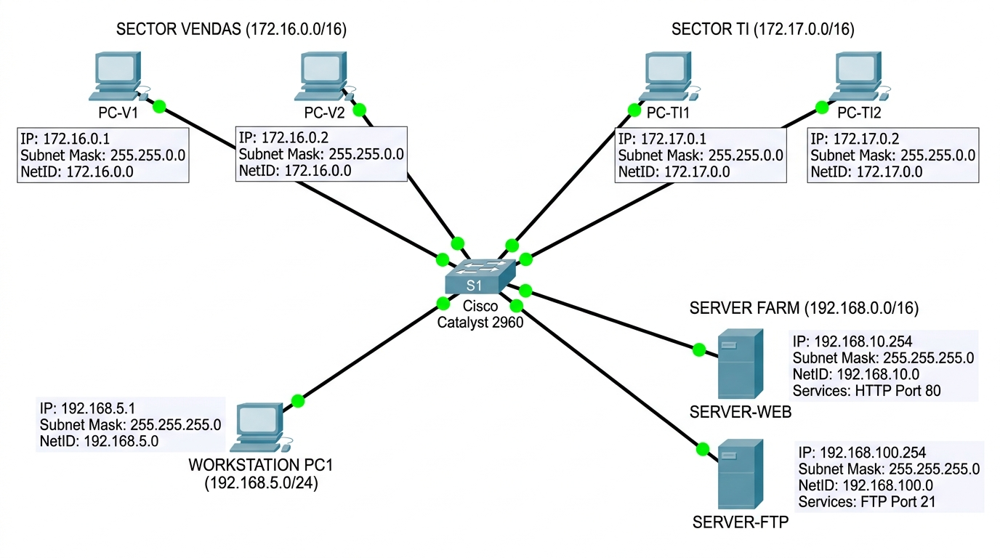
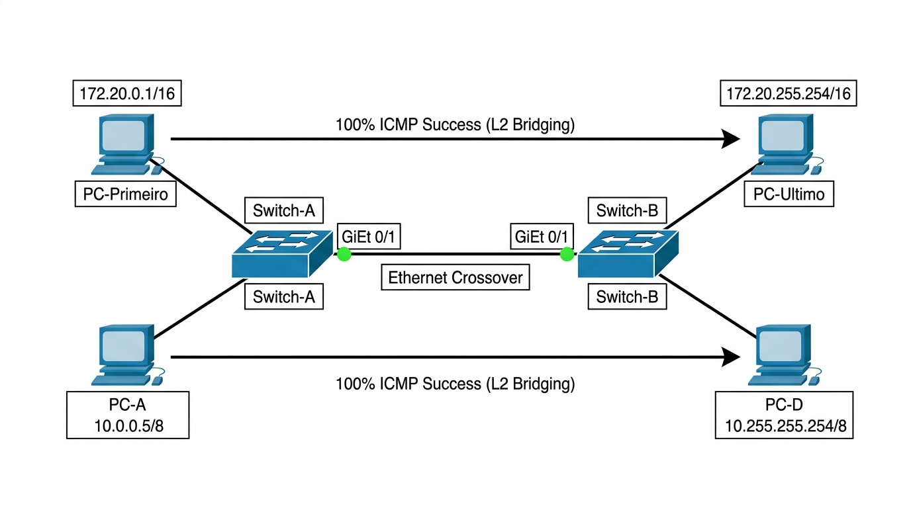

# INSTITUTO FEDERAL DE EDUCAÇÃO, CIÊNCIA E TECNOLOGIA DE SÃO PAULO
## Câmpus São Carlos — Bacharelado em Engenharia de Software / ADS
**Disciplina:** Redes de Computadores 2 (SCLRCO2)  
**Docente:** Prof. Dr. Luiz Henrique Castelo Branco  
**Discente:** Rafael Feltrim  
**Data:** 17 de Agosto de 2026  

---

# ATIVIDADE 05: ENDEREÇAMENTO IPV4 — REDE, BROADCAST E HOSTS
*Documento de Referência: `lista_exercicios_ipv4_ifsp.pdf` (50 Exercícios Teórico-Práticos no Cisco Packet Tracer)*

---

## PARTE 1: EXERCÍCIOS TEÓRICOS DE CÁLCULO E FIXAÇÃO (1 A 40)

### Bloco A: Identificação de Classe e Máscara Padrão (Exercícios 1 a 10)

| Nº | Endereço IP | Classe | Máscara Sub-rede Padrão | Nº | Endereço IP | Classe | Máscara Sub-rede Padrão |
| :-: | :--- | :---: | :--- | :-: | :--- | :---: | :--- |
| **1** | `10.150.2.1` | **A** | `255.0.0.0` (/8) | **6** | `200.100.10.5` | **C** | `255.255.255.0` (/24) |
| **2** | `172.20.100.5` | **B** | `255.255.0.0` (/16) | **7** | `11.0.0.10` | **A** | `255.0.0.0` (/8) |
| **3** | `192.168.50.12` | **C** | `255.255.255.0` (/24) | **8** | `150.150.150.150` | **B** | `255.255.0.0` (/16) |
| **4** | `120.30.40.50` | **A** | `255.0.0.0` (/8) | **9** | `193.10.11.12` | **C** | `255.255.255.0` (/24) |
| **5** | `180.10.1.1` | **B** | `255.255.0.0` (/16) | **10** | `126.255.254.1` | **A** | `255.0.0.0` (/8) |

---

### Bloco B: Cálculo de NetID, Broadcast e Faixa Válida de Hosts (Exercícios 11 a 25)

| Nº | Endereço IP Fornecido | Rede (NetID) | Broadcast | 1º Host Válido | Último Host Válido | Total Hosts Válidos |
| :-: | :--- | :--- | :--- | :--- | :--- | :-: |
| **11** | `192.168.10.45 /24` | `192.168.10.0` | `192.168.10.255` | `192.168.10.1` | `192.168.10.254` | 254 |
| **12** | `172.16.88.200 /16` | `172.16.0.0` | `172.16.255.255` | `172.16.0.1` | `172.16.255.254` | 65.534 |
| **13** | `10.200.50.7 /8` | `10.0.0.0` | `10.255.255.255` | `10.0.0.1` | `10.255.255.254` | 16.777.214 |
| **14** | `192.168.0.254 /24` | `192.168.0.0` | `192.168.0.255` | `192.168.0.1` | `192.168.0.254` | 254 |
| **15** | `172.31.250.1 /16` | `172.31.0.0` | `172.31.255.255` | `172.31.0.1` | `172.31.255.254` | 65.534 |
| **16** | `201.20.30.100 /24` | `201.20.30.0` | `201.20.30.255` | `201.20.30.1` | `201.20.30.254` | 254 |
| **17** | `10.55.100.200 /8` | `10.0.0.0` | `10.255.255.255` | `10.0.0.1` | `10.255.255.254` | 16.777.214 |
| **18** | `130.40.50.60 /16` | `130.40.0.0` | `130.40.255.255` | `130.40.0.1` | `130.40.255.254` | 65.534 |
| **19** | `192.168.100.1 /24` | `192.168.100.0` | `192.168.100.255` | `192.168.100.1` | `192.168.100.254` | 254 |
| **20** | `172.25.0.5 /16` | `172.25.0.0` | `172.25.255.255` | `172.25.0.1` | `172.25.255.254` | 65.534 |
| **21** | `10.0.0.1 /8` | `10.0.0.0` | `10.255.255.255` | `10.0.0.1` | `10.255.255.254` | 16.777.214 |
| **22** | `220.10.10.10 /24` | `220.10.10.0` | `220.10.10.255` | `220.10.10.1` | `220.10.10.254` | 254 |
| **23** | `160.10.255.1 /16` | `160.10.0.0` | `160.10.255.255` | `160.10.0.1` | `160.10.255.254` | 65.534 |
| **24** | `192.168.254.200 /24` | `192.168.254.0` | `192.168.254.255` | `192.168.254.1` | `192.168.254.254` | 254 |
| **25** | `10.254.254.254 /8` | `10.0.0.0` | `10.255.255.255` | `10.0.0.1` | `10.255.255.254` | 16.777.214 |

---

### Bloco C: Análise de Validade, Regras e Diagnósticos (Exercícios 26 a 40)

- **26. O endereço 192.168.1.255/24 pode ser atribuído diretamente à placa de rede de um computador?**  
  **Não.** Em uma rede `/24` (`255.255.255.0`), o octeto `.255` possui todos os 8 bits de host em `1` (`11111111_2`), sendo reservado estritamente como endereço de Broadcast da rede local.

- **27. O endereço 10.0.0.0/8 é um IP válido para host? Qual sua função?**  
  **Não.** O IP com todos os bits da porção de host em `0` representa o identificador da rede em si (NetID), utilizado pelas tabelas de roteamento para direcionar pacotes ao segmento.

- **28. Um técnico configurou dois PCs com os IPs 172.16.5.10 e 172.17.5.10 (máscara 255.255.0.0). Eles se comunicam via switch?**  
  **Não.** Os NetIDs calculados são `172.16.0.0` e `172.17.0.0`. Por estarem em redes lógicas distintas, a comunicação direta em Camada 2 falha; é mandatório um Roteador (Default Gateway).

- **29. Qual é o endereço de broadcast para a sub-rede 192.168.100.0/24?**  
  **`192.168.100.255`** (obtido fixando os 24 bits de rede e setando todos os 8 bits de host em `1`).

- **30. Quantos hosts válidos cabem em uma rede de Classe B com máscara padrão (255.255.0.0)?**  
  Fórmula: $2^{16} - 2 = \mathbf{65.534\text{ hosts utilizáveis}}$ (descontando o NetID e o Broadcast).

- **31. Por que o intervalo 127.0.0.0 a 127.255.255.255 não pertence às classes para atribuição de hosts?**  
  O bloco `127.0.0.0/8` é reservado pelo protocolo TCP/IP para testes de loopback local (pilha interna da placa de rede), nunca sendo roteado externamente.

- **32. Em Classe A (255.0.0.0), os IPs 10.1.2.3 e 10.200.150.50 pertencem à mesma rede lógica?**  
  **Sim.** Na Classe A (`/8`), a máscara avalia apenas o primeiro octeto (`10`). Como ambos iniciam com `10`, compartilham o mesmo NetID (`10.0.0.0`).

- **33. Identifique qual octeto representa o HostID e quais representam o NetID em 188.10.50.2/16:**  
  **NetID:** `188.10` (1º e 2º octetos) | **HostID:** `50.2` (3º e 4º octetos).

- **34. Qual é o resultado da operação AND entre 192.168.15.50 e a máscara 255.255.255.0?**  
  O NetID gerado é **`192.168.15.0`** (os primeiros 24 bits são preservados e o último octeto é zerado: `50 AND 0 = 0`).

- **35. Um computador com IP 192.168.1.50/24 tenta pingar 192.168.2.50. O pacote sai pelo gateway?**  
  **Sim.** A operação AND revela que o destino (`192.168.2.0`) pertence a uma rede lógica externa, forçando o envio do pacote ao Default Gateway.

- **36. Explique a diferença técnica entre o primeiro IP da rede (NetID) e o último IP (Broadcast):**  
  O **NetID** identifica a rede lógica nas tabelas de roteamento; o **Broadcast** é utilizado para transmitir um pacote simultaneamente a todos os nós do segmento.

- **37. Rede para 500 computadores na mesma sub-rede: Classe C atende? Qual classe usar?**  
  **Não atende** (Classe C suporta no máx. 254 hosts). Deve-se utilizar uma **Classe B padrão (/16)** ou técnica CIDR (ex: `/23` com 510 hosts).

- **38. Qual é o total de redes possíveis na Classe C e quantos hosts cada uma pode ter?**  
  Possui $2^{21} = \mathbf{2.097.152\text{ redes possíveis}}$, cada uma suportando $2^8 - 2 = \mathbf{254\text{ hosts válidos}}$.

- **39. Dada a máscara 255.255.255.0, determine a Notação CIDR correspondente:**  
  A notação correspondente é **`/24`** (24 bits contíguos em nível lógico 1).

- **40. Dado o IP 172.16.10.10 e máscara 255.255.0.0, quais são o primeiro e o último IP reutilizáveis?**  
  Primeiro host válido: **`172.16.0.1`** | Último host válido: **`172.16.255.254`**.

---

## PARTE 2: ATIVIDADES PRÁTICAS NO CISCO PACKET TRACER (41 A 50)

| Ativ. | Título do Laboratório &amp; Topologia | Pré-Cálculo de Endereçamento | Validação &amp; Comportamento Técnico no Simulador |
| :-: | :--- | :--- | :--- |
| **41** | **Conectividade Básica Classe C** (1 Switch + 3 PCs) | Bloco `192.168.5.0/24` NetID: `192.168.5.0` \| BC: `.255` Hosts: `.1`, `.2`, `.3` | Ping entre PC1, PC2 e PC3 com **0% de perda (&lt;1ms)** diretamente em L2 via tabela CAM. |
| **42** | **Limites Extremos na Classe B** (1 Switch + 2 PCs) | Bloco `172.20.0.0/16` 1º Host: `172.20.0.1` Último Host: `172.20.255.254` | Comunicação flui com **100% de sucesso**, comprovando que nós nos limites extremos compartilham o NetID. |
| **43** | **Diagnóstico de IP de Broadcast** (Tentativa de atribuição) | Rede `192.168.1.0/24` Broadcast: `192.168.1.255` | Ao tentar configurar o IP `.255` no PC2, o software rejeita: *Invalid IP for this subnet mask*. |
| **44** | **Isolamento de Setores no Switch** (Vendas vs TI no mesmo Switch) | Vendas: `172.16.0.1` e `.2` (/16) TI: `172.17.0.1` e `.2` (/16) | PCs do mesmo setor pingam entre si. Ping de Vendas para TI resulta em **Request Timed Out** (sem roteador). |
| **45** | **Publicação de Servidor Web Local** (1 Switch + 2 PCs + Server) | Clientes: `192.168.10.1` e `.2` Server-WEB: `192.168.10.254` | Navegador dos PCs acessa **http://192.168.10.254 (HTTP 200 OK)**; `arp -a` exibe o MAC do servidor. |
| **46** | **Comunicação em Classe A** (Variação em 3 octetos) | IPs: `10.0.0.5`, `10.1.10.20`, `10.100.200.1`, `10.255.255.254` | Ping entre todos os 4 PCs obtém **100% de êxito**. A máscara `/8` valida apenas o 1º octeto (10). |
| **47** | **Simulação de Broadcast L2/L3** (Broadcast de Classe A) | Broadcast: `10.255.255.255` PCs em Classes A, B e C | Em modo de simulação, o switch inunda todas as portas (L2 Flooding). PCs em B e C executam **Layer 3 Drop**. |
| **48** | **Falha por Erro de Máscara** (PC1 /24 vs PC2 /16) | PC1: `192.168.10.1/24` PC2: `192.168.10.2/16` | Comunicação local responde, mas ocorre assimetria: PC2 trata IPs externos como locais (enviando ARP inútil). |
| **49** | **Múltiplos Servidores na LAN** (Servidor HTTP e FTP) | Cliente: `192.168.100.1` HTTP: `.253` \| FTP: `.254` | Cliente resolve tráfego web (porta 80) e FTP (porta 21) na mesma sub-rede sem necessidade de roteador. |
| **50** | **Interconexão de 2 Switches L2** (Link via Cabo Crossover) | Rede `172.16.0.0/16` 4 PCs em 2 switches | Com o link crossover entre portas Gi0/1 dos switches, o domínio L2 é expandido com **100% de sucesso no ping**. |

---

## EVIDÊNCIAS VISUAIS DE SIMULAÇÃO (CISCO PACKET TRACER)

### Figura 1: Topologia de Isolamento de Setores (Vendas vs TI) e Servidores WEB/FTP (Atividades 41, 44, 45 e 49)

*Ambiente demonstrando o isolamento L3 entre os setores Vendas e TI e a publicação de servidores HTTP e FTP locais no switch Cisco Catalyst 2960.*

### Figura 2: Diagrama de Interconexão de Múltiplos Switches L2 com Cabo Crossover (Atividades 42, 46, 47 e 50)

*Expansão de domínio de broadcast e testes de comunicação entre nós nos limites extremos (172.20.0.1 e 172.20.255.254) através de switches interligados.*

---

## CONCLUSÃO TÉCNICA E SÍNTESE DO APRENDIZADO
1. **Domínios L2 vs Segmentação L3:** O ambiente prático comprovou que o switch comuta quadros com base exclusiva na tabela MAC. A segmentação de redes (NetIDs distintos) opera na Camada 3, impedindo o tráfego não autorizado mesmo sobre o mesmo meio físico.
2. **Resolução ARP e Handshake de Aplicação:** A captura em modo de simulação evidenciou que a transmissão de dados de aplicação (HTTP/FTP) é precedida pelo broadcast ARP e pelo three-way handshake TCP.
3. **Integridade de Máscara:** Erros na máscara padrão desestabilizam o cálculo de localidade da pilha TCP/IP, reforçando a importância do correto planejamento de endereçamento classful e CIDR.
