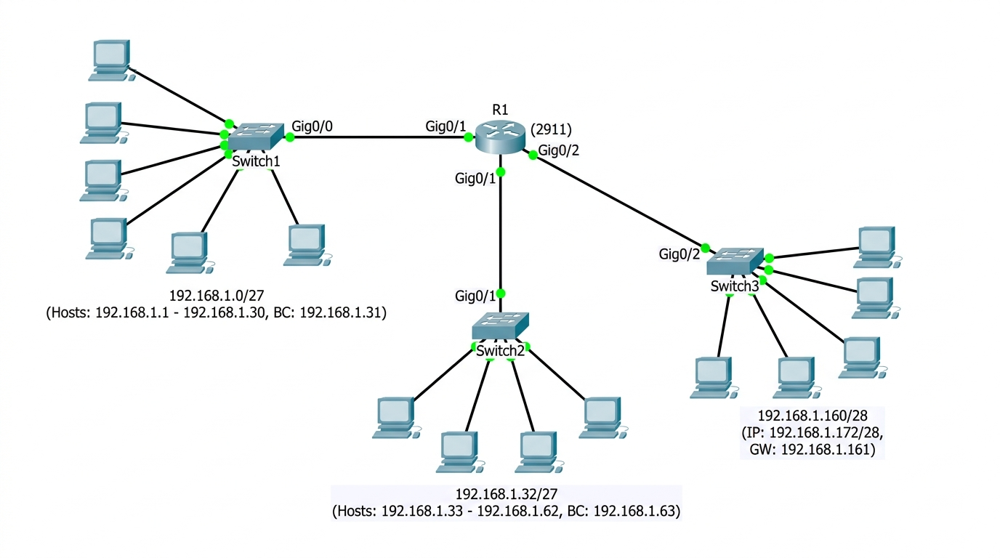
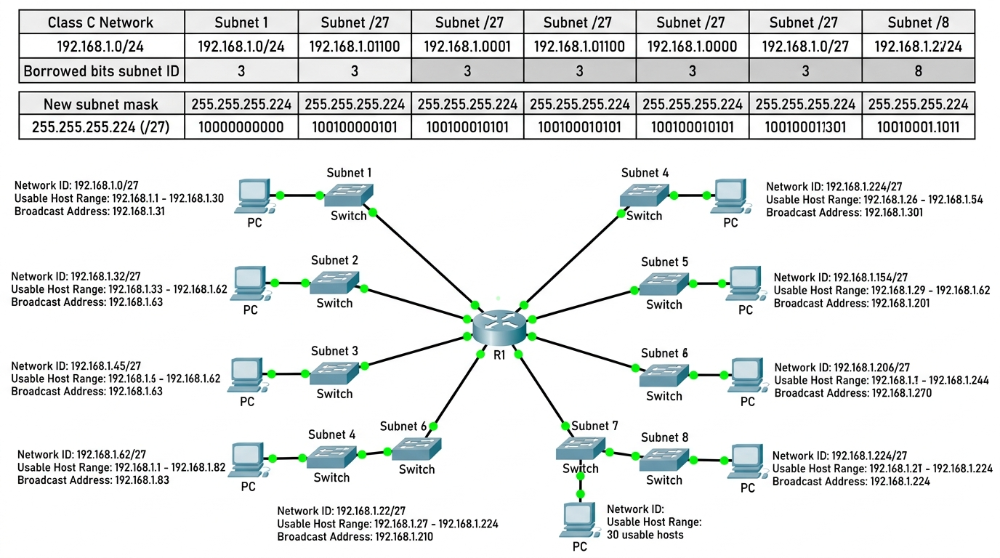

# INSTITUTO FEDERAL DE EDUCAÇÃO, CIÊNCIA E TECNOLOGIA DE SÃO PAULO
## Câmpus São Carlos — Bacharelado em Engenharia de Software / ADS
**Disciplina:** Redes de Computadores 2 (SCLRCO2)  
**Docente:** Prof. Dr. Luiz Henrique Castelo Branco  
**Discente:** Rafael Feltrim  
**Data:** 17 de Agosto de 2026  

---

# ATIVIDADE 06: ENDEREÇAMENTO IP (SUB-REDES - PARTE 1)
*Documento de Referência: `questoes revisao - endereçamento IP-parte2.pdf` (Baseado no Guia CCNA da Cisco e Fourouzan Cap. 1)*

---

## 1. Classificação de Classes e Cálculos de Rede, Broadcast e Hosts

**Enunciado:** Classificar como classe A, B ou C e calcular o endereço de rede, broadcast e de host dos seguintes IPs:
- **a.** `172.16.32.54/16`
- **b.** `192.168.32.14/24`
- **c.** `192.168.1.255/24`
- **d.** `10.12.1.21/8`

### Tabela Consolidada de Resultados

| Item / Endereço IP | Classe | Máscara Padrão | Endereço de Rede (NetID) | Endereço de Broadcast | Faixa Válida de Hosts (Utilizáveis) | Total de Hosts Úteis |
| :--- | :---: | :---: | :---: | :---: | :---: | :---: |
| **a. 172.16.32.54/16** | **B** | `255.255.0.0` (/16) | `172.16.0.0` | `172.16.255.255` | `172.16.0.1` – `172.16.255.254` | 65.534 |
| **b. 192.168.32.14/24** | **C** | `255.255.255.0` (/24) | `192.168.32.0` | `192.168.32.255` | `192.168.32.1` – `192.168.32.254` | 254 |
| **c. 192.168.1.255/24** | **C** | `255.255.255.0` (/24) | `192.168.1.0` | `192.168.1.255` | `192.168.1.1` – `192.168.1.254` | 254 |
| **d. 10.12.1.21/8** | **A** | `255.0.0.0` (/8) | `10.0.0.0` | `10.255.255.255` | `10.0.0.1` – `10.255.255.254` | 16.777.214 |

> **Nota Técnica Diagnóstica (Item C):**  
> O endereço `192.168.1.255/24` possui todos os 8 bits da porção de host iguais a `1` (`11111111_2`). Portanto, ele representa o **endereço de Broadcast da rede** e não pode ser configurado em uma placa de rede (interface de host).

---

## 2. Cálculo de Sub-rede para o IP `192.168.1.172/28`

**Enunciado:** Calcular o endereço de rede, broadcast e de host do seguinte IP: `192.168.1.172/28`.

### Memória de Cálculo Passo a Passo:
1. **Máscara de Sub-rede:** `/28` $\implies 28$ bits 1 e 4 bits 0 $\implies$ `11111111.11111111.11111111.11110000` $\implies$ **`255.255.255.240`**.
2. **Bits de Host ($h$):** $32 - 28 = 4$ bits.
3. **Tamanho do Bloco / Incremento ($I$):** $I = 2^h = 2^4 = 16$ (ou $256 - 240 = 16$).
4. **Localização do Bloco (4º octeto = 172):**
   - Intervalos de sub-rede: $0, 16, 32, 48, 64, 80, 96, 112, 128, 144, \mathbf{160}, 176\dots$
   - Como $160 \le 172 < 176$, o IP pertence à sub-rede iniciada em **160**.

### Resultados Finais:
- **Endereço de Rede (NetID):** `192.168.1.160/28`
- **Endereço de Broadcast:** `192.168.1.175` ($160 + 16 - 1 = 175$)
- **Faixa Válida de Hosts (Utilizáveis):** `192.168.1.161` até `192.168.1.174`
- **Diagnóstico do IP Fornecido:** `192.168.1.172` é o **12º host válido** desta sub-rede.
- **Capacidade por Sub-rede:** $2^4 - 2 = 14$ hosts válidos.

---

## 3. Cálculo de Rede e Broadcast para Múltiplas Máscaras

**Enunciado:** Calcular o endereço de rede e broadcast dos seguintes endereços IPs:
- **a.** `192.168.1.35/28`
- **b.** `172.16.193.0/10`
- **c.** `192.168.2.127/25`

### Tabela de Resolução Detalhada:

| Endereço IP / CIDR | Máscara Decimal | Octeto de Variação | Incremento (Bloco) | Endereço de Rede (NetID) | Endereço de Broadcast | Faixa Válida de Hosts |
| :--- | :---: | :---: | :---: | :---: | :---: | :---: |
| **a. 192.168.1.35/28** | `255.255.255.240` | 4º octeto | $2^4 = 16$ | **`192.168.1.32`** | **`192.168.1.47`** | `192.168.1.33` a `192.168.1.46` *(14 hosts)* |
| **b. 172.16.193.0/10** | `255.192.0.0` | 2º octeto | $2^6 = 64$ | **`172.0.0.0`** | **`172.63.255.255`** | `172.0.0.1` a `172.63.255.254` *(4.194.302 hosts)* |
| **c. 192.168.2.127/25** | `255.255.255.128` | 4º octeto | $2^7 = 128$ | **`192.168.2.0`** | **`192.168.2.127`** | `192.168.2.1` a `192.168.2.126` *(126 hosts)* |

> **Nota Técnica (Item C):** O endereço fornecido `192.168.2.127` coincide exatamente com o endereço de Broadcast do primeiro bloco `/25`.

---

## 4. Projeto de Sub-redes FLSM (Rede `192.168.1.0/24` para $\le$ 30 Hosts/Sub-rede)

**Enunciado:** Divida em sub-redes a rede `192.168.1.0/24` de forma a obter no máximo 30 hosts por sub-rede.

### Engenharia e Dimensionamento:
1. **Determinação dos bits de host ($h$):**  
   Fórmula de capacidade útil: $2^h - 2 \ge 30 \implies 2^h \ge 32 \implies \mathbf{h = 5\text{ bits}}$.  
   Capacidade por sub-rede: $2^5 - 2 = \mathbf{30\text{ hosts válidos}}$ (atendimento exato ao limite sem desperdício).
2. **Determinação dos bits de sub-rede ($s$):**  
   $s = 8\text{ bits originais} - 5\text{ bits de host} = \mathbf{3\text{ bits emprestados}}$.
3. **Nova Máscara:** $/24 + 3 = \mathbf{/27} \implies \mathbf{255.255.255.224}$ (`11100000_2`).
4. **Total de Sub-redes Criadas:** $2^s = 2^3 = \mathbf{8\text{ sub-redes}}$.
5. **Tamanho do Bloco / Incremento ($I$):** $I = 256 - 224 = \mathbf{32}$ (ou $2^5 = 32$).

### Tabela Completa de Endereçamento das 8 Sub-redes Criadas:

| Sub-rede | Endereço de Rede (NetID) | 1º Host Válido | Último Host Válido | Endereço de Broadcast | Máscara Decimal | Hosts Úteis |
| :--- | :--- | :--- | :--- | :--- | :--- | :---: |
| **Sub-rede 1** | `192.168.1.0/27` | `192.168.1.1` | `192.168.1.30` | `192.168.1.31` | `255.255.255.224` | 30 |
| **Sub-rede 2** | `192.168.1.32/27` | `192.168.1.33` | `192.168.1.62` | `192.168.1.63` | `255.255.255.224` | 30 |
| **Sub-rede 3** | `192.168.1.64/27` | `192.168.1.65` | `192.168.1.94` | `192.168.1.95` | `255.255.255.224` | 30 |
| **Sub-rede 4** | `192.168.1.96/27` | `192.168.1.97` | `192.168.1.126` | `192.168.1.127` | `255.255.255.224` | 30 |
| **Sub-rede 5** | `192.168.1.128/27` | `192.168.1.129` | `192.168.1.158` | `192.168.1.159` | `255.255.255.224` | 30 |
| **Sub-rede 6** | `192.168.1.160/27` | `192.168.1.161` | `192.168.1.190` | `192.168.1.191` | `255.255.255.224` | 30 |
| **Sub-rede 7** | `192.168.1.192/27` | `192.168.1.193` | `192.168.1.222` | `192.168.1.223` | `255.255.255.224` | 30 |
| **Sub-rede 8** | `192.168.1.224/27` | `192.168.1.225` | `192.168.1.254` | `192.168.1.255` | `255.255.255.224` | 30 |

---

## 5. Evidências Visuais e Diagramas de Topologia (Cisco Packet Tracer)

### Figura 1: Topologia de Sub-redes Interconectadas no Cisco Packet Tracer

*Roteador Cisco 2911 roteando o tráfego entre os blocos /27 e /28 com Switches 2960 e estações de trabalho.*

### Figura 2: Diagrama de Particionamento e Mapeamento FLSM

*Mapeamento da divisão da rede Classe C 192.168.1.0/24 em 8 sub-redes /27.*

---

## 6. Conclusões Técnicas
1. **Isolamento de Domínios de Broadcast:** A criação de sub-redes com máscara `/27` reduz o volume de tráfego desnecessário na rede local, isolando os domínios de broadcast em nível de enlace (Camada 2).
2. **Encaminhamento de Camada 3:** Máquinas em sub-redes distintas dependem exclusivamente de um Roteador (Default Gateway) para se comunicarem, assegurando o controle e segurança entre segmentos.
3. **Eficiência de Endereçamento:** A divisão em 8 sub-redes de 30 hosts elimina a fragmentação e maximiza o aproveitamento do bloco IPv4 fornecido.
