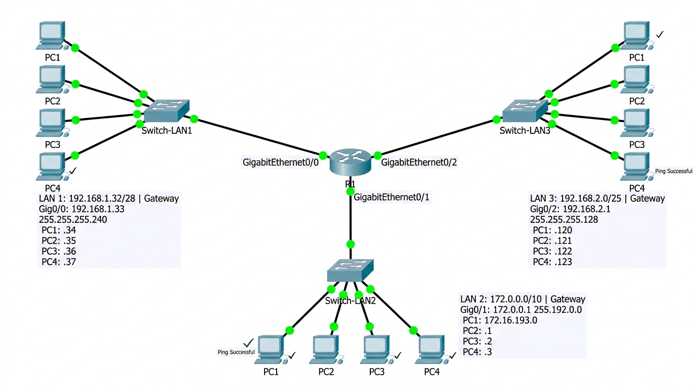

# INSTITUTO FEDERAL DE EDUCAÇÃO, CIÊNCIA E TECNOLOGIA DE SÃO PAULO

## Câmpus São Carlos — Bacharelado em Engenharia de Software / ADS

**Disciplina:** Redes de Computadores 2 (SCLRCO2)
**Docente:** Prof. Dr. Luiz Henrique Castelo Branco
**Discente:** Rafael Feltrim
**Data:** 17 de Agosto de 2026

---

# ATIVIDADE 07: INTERLIGAÇÃO DE 3 LANS COM ROTEADOR NO CISCO PACKET TRACER

*Tema: Roteamento Inter-Classes com Máscaras Variadas (/28, /10 e /25)*

---

## 1. Especificação do Cenário e Memória de Cálculo das 3 LANs

O objetivo desta atividade é projetar, configurar e validar a interligação de 3 redes locais (LANs) de classes e sub-redes distintas através de um Roteador Cisco (Camada 3), contendo pelo menos 4 estações de trabalho em cada LAN.

### Tabela de Sub-redes e Dimensionamento:

| Segmento        | Endereço de Referência | Máscara Decimal    | Endereço de Rede (NetID)     | Default Gateway (Roteador) | Faixa Válida de Hosts                                   | Endereço de Broadcast |
| :-------------- | :----------------------- | :------------------ | :---------------------------- | :------------------------- | :------------------------------------------------------- | :--------------------- |
| **LAN 1** | `192.168.1.35/28`      | `255.255.255.240` | **`192.168.1.32/28`** | `192.168.1.33` (Gig0/0)  | `192.168.1.33` a `192.168.1.46` *(14 hosts)*       | `192.168.1.47`       |
| **LAN 2** | `172.16.193.0/10`      | `255.192.0.0`     | **`172.0.0.0/10`**    | `172.0.0.1` (Gig0/1)     | `172.0.0.1` a `172.63.255.254` *(4.194.302 hosts)* | `172.63.255.255`     |
| **LAN 3** | `192.168.2.122/25`     | `255.255.255.128` | **`192.168.2.0/25`**  | `192.168.2.1` (Gig0/2)   | `192.168.2.1` a `192.168.2.126` *(126 hosts)*      | `192.168.2.127`      |

---

## 2. Plano de Endereçamento dos Dispositivos (12 Hosts + Roteador)

| Segmento        | Dispositivo            | Endereço IP      | Máscara Sub-rede   | Default Gateway       | Interface / Papel                  |
| :-------------- | :--------------------- | :---------------- | :------------------ | :-------------------- | :--------------------------------- |
| **LAN 1** | **R1 (Gateway)** | `192.168.1.33`  | `255.255.255.240` | *N/A (Roteador L3)* | GigabitEthernet0/0                 |
|                 | **PC1-LAN1**     | `192.168.1.34`  | `255.255.255.240` | `192.168.1.33`      | FastEthernet0                      |
|                 | **PC2-LAN1**     | `192.168.1.35`  | `255.255.255.240` | `192.168.1.33`      | FastEthernet0*(IP do Enunciado)* |
|                 | **PC3-LAN1**     | `192.168.1.36`  | `255.255.255.240` | `192.168.1.33`      | FastEthernet0                      |
|                 | **PC4-LAN1**     | `192.168.1.37`  | `255.255.255.240` | `192.168.1.33`      | FastEthernet0                      |
| **LAN 2** | **R1 (Gateway)** | `172.0.0.1`     | `255.192.0.0`     | *N/A (Roteador L3)* | GigabitEthernet0/1                 |
|                 | **PC1-LAN2**     | `172.16.193.0`  | `255.192.0.0`     | `172.0.0.1`         | FastEthernet0*(IP do Enunciado)* |
|                 | **PC2-LAN2**     | `172.16.193.1`  | `255.192.0.0`     | `172.0.0.1`         | FastEthernet0                      |
|                 | **PC3-LAN2**     | `172.16.193.2`  | `255.192.0.0`     | `172.0.0.1`         | FastEthernet0                      |
|                 | **PC4-LAN2**     | `172.16.193.3`  | `255.192.0.0`     | `172.0.0.1`         | FastEthernet0                      |
| **LAN 3** | **R1 (Gateway)** | `192.168.2.1`   | `255.255.255.128` | *N/A (Roteador L3)* | GigabitEthernet0/2                 |
|                 | **PC1-LAN3**     | `192.168.2.120` | `255.255.255.128` | `192.168.2.1`       | FastEthernet0                      |
|                 | **PC2-LAN3**     | `192.168.2.121` | `255.255.255.128` | `192.168.2.1`       | FastEthernet0                      |
|                 | **PC3-LAN3**     | `192.168.2.122` | `255.255.255.128` | `192.168.2.1`       | FastEthernet0*(IP do Enunciado)* |
|                 | **PC4-LAN3**     | `192.168.2.123` | `255.255.255.128` | `192.168.2.1`       | FastEthernet0                      |

---

## 3. Script de Configuração do Roteador Cisco 2911 (Cisco IOS)

```ios
Router> enable
Router# configure terminal
Router(config)# hostname R1-INTERLIGACAO

! ===================================================
! INTERFACE LAN 1: Sub-rede 192.168.1.32/28
! ===================================================
R1-INTERLIGACAO(config)# interface GigabitEthernet0/0
R1-INTERLIGACAO(config-if)# description Gateway LAN 1 (/28)
R1-INTERLIGACAO(config-if)# ip address 192.168.1.33 255.255.255.240
R1-INTERLIGACAO(config-if)# no shutdown
R1-INTERLIGACAO(config-if)# exit

! ===================================================
! INTERFACE LAN 2: Sub-rede 172.0.0.0/10
! ===================================================
R1-INTERLIGACAO(config)# interface GigabitEthernet0/1
R1-INTERLIGACAO(config-if)# description Gateway LAN 2 (/10)
R1-INTERLIGACAO(config-if)# ip address 172.0.0.1 255.192.0.0
R1-INTERLIGACAO(config-if)# no shutdown
R1-INTERLIGACAO(config-if)# exit

! ===================================================
! INTERFACE LAN 3: Sub-rede 192.168.2.0/25
! ===================================================
R1-INTERLIGACAO(config)# interface GigabitEthernet0/2
R1-INTERLIGACAO(config-if)# description Gateway LAN 3 (/25)
R1-INTERLIGACAO(config-if)# ip address 192.168.2.1 255.255.255.128
R1-INTERLIGACAO(config-if)# no shutdown
R1-INTERLIGACAO(config-if)# exit

R1-INTERLIGACAO(config)# end
R1-INTERLIGACAO# copy running-config startup-config
```

---

## 4. Evidência Visual da Topologia no Cisco Packet Tracer

### Figura 1: Topologia de Interconexão das 3 LANs no Roteador Cisco 2911


*Roteador Cisco 2911 central interligando as 3 LANs (/28, /10 e /25) com Switches Cisco Catalyst 2960 e 12 estações de trabalho.*

---

## 5. Validação de Conectividade e Testes de Ping (ICMP)

| Origem                                 | Destino                                | Trânsito L3                                |         Resultado do Ping         | Análise Técnica                      |
| :------------------------------------- | :------------------------------------- | :------------------------------------------ | :-------------------------------: | :------------------------------------- |
| **PC2-LAN1** (`192.168.1.35`)  | **PC1-LAN2** (`172.16.193.0`)  | Encaminhado via`Gig0/0` &rarr; `Gig0/1` | **100% Sucesso (0% perda)** | Roteamento inter-redes bem-sucedido    |
| **PC1-LAN2** (`172.16.193.0`)  | **PC3-LAN3** (`192.168.2.122`) | Encaminhado via`Gig0/1` &rarr; `Gig0/2` | **100% Sucesso (0% perda)** | Resolução ARP + encaminhamento L3    |
| **PC3-LAN3** (`192.168.2.122`) | **PC2-LAN1** (`192.168.1.35`)  | Encaminhado via`Gig0/2` &rarr; `Gig0/0` | **100% Sucesso (0% perda)** | Ida e volta (Echo / Reply) confirmados |

---

## 6. Conclusões Técnicas

1. **Roteamento de Sub-redes Heterogêneas:** O Roteador Cisco 2911 mantém na sua tabela de rotas três entradas *Directly Connected* (`C`), viabilizando a comunicação fluida e direta entre redes com comprimentos de prefixo distintos (`/28`, `/10` e `/25`).
2. **Separação de Domínios de Broadcast:** Cada interface do roteador atua como fronteira de broadcast. Broadcasts gerados na LAN 1 não poluem a LAN 2 nem a LAN 3.
3. **Encaminhamento de Pacotes:** A configuração de Default Gateway em cada computador permite que pacotes com destino a redes externas sejam enviados ao roteador via quadro Ethernet L2, onde o roteador faz a reescrita do cabeçalho de enlace e encaminha o pacote em Camada 3.
